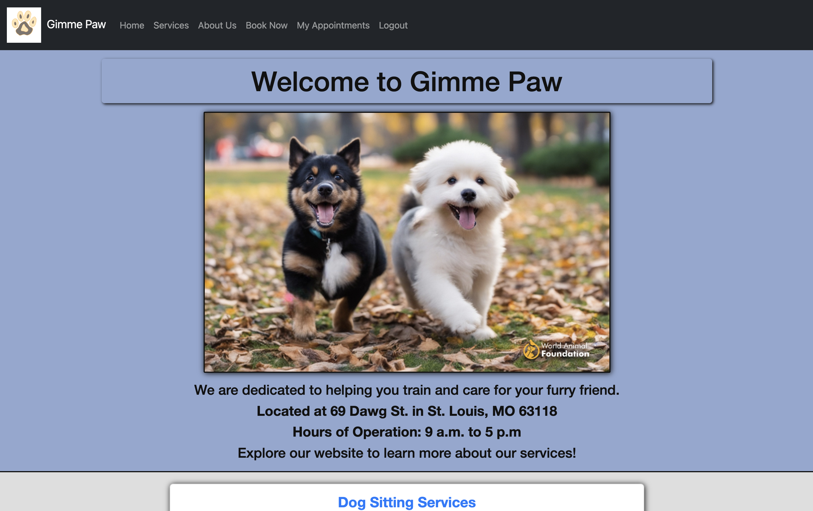
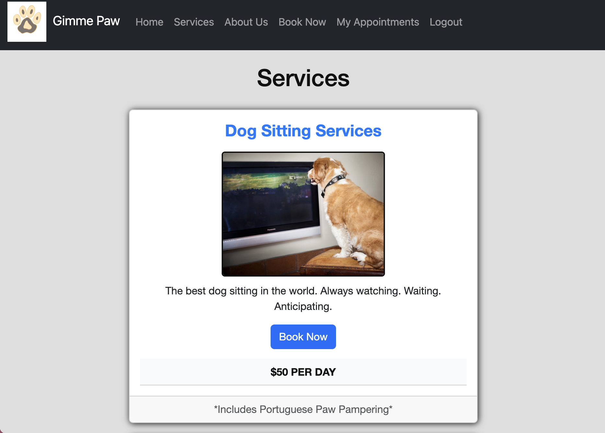
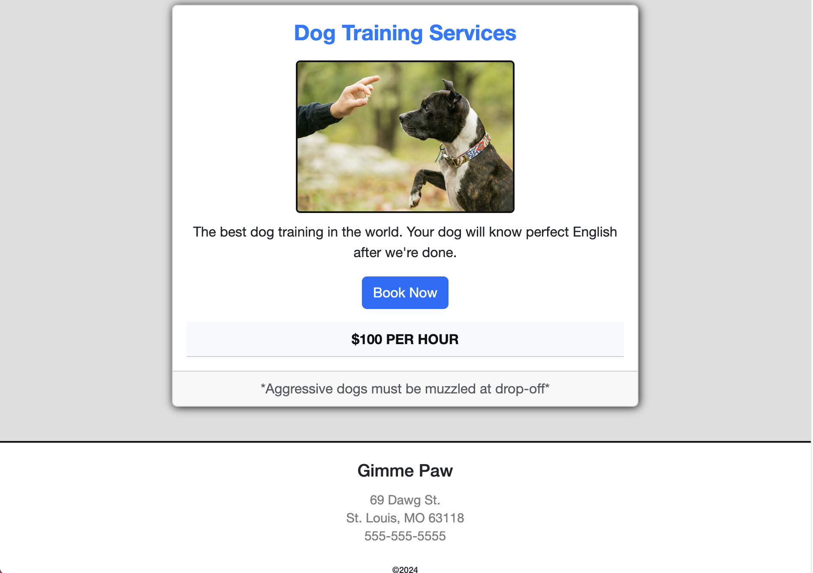
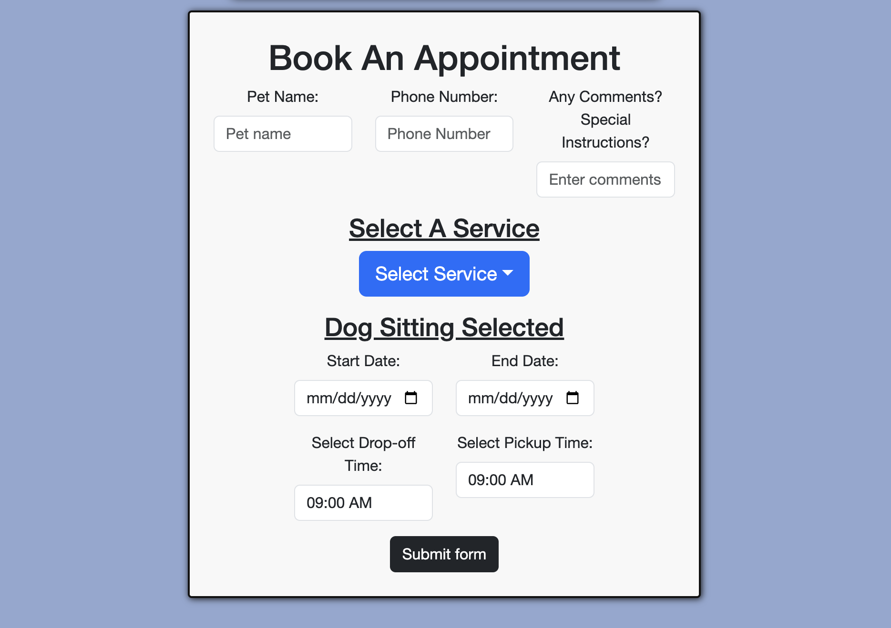

# Gimme Paw

## Table of Contents

 - [Description](#description)
 - [User Story](#user-story)
 - [Installation](#installation)
 - [Images](#images)
 - [Deployment Link](#deployment-link)
 - [Credits](#credits)
 - [License](#license)

## Description

Application for Gimme Paw dog training and pet sitting business. The motivation was to create an application that can be used in a real-world scenario for a small business. The site will have services offered, pricing, an about page, and a module for booking appointments or consultations.

## User Story

```md
AS AN user who wants their dog(s) trained and/or dogsitting
I WANT to book an appointment through a small business' website
SO THAT I can easily see my scheduled appointments and browse the business' services.
```

## Installation

 - bootstrap 5.3.3
 - react
 - react-bootstrap
 - @apollo/server
 - @apollo/client
 - bcrypt
 - express
 - graphql
 - jwt
 - jsonwebtoken
 - mongoose
 - nodemon 
 - styled components

 - 'npm install && npm run develop' to start application

## Images

### Home Page Preview



### Services Preview - Dog Sitting



### Services Preview - Dog Training



### Book Appointment Preview



## Deployment Link

Render: https://greatk9s-lz2b.onrender.com

## Credits

 - Webpage by: Nick Almond, Peyton Weber, Matthew Rallo, Devin Little, Michael Kickham, Sarah Padilla
 - Institution: WashU in St. Louis
 - Course: Full Stack Development Bootcamp
 - Instructors: Brett Gaynor, Chris Pesar

## License

